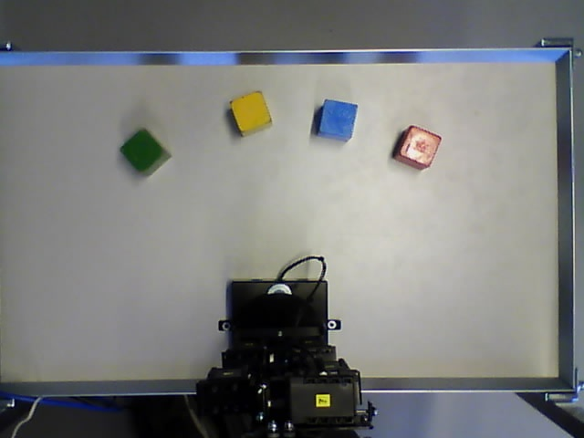
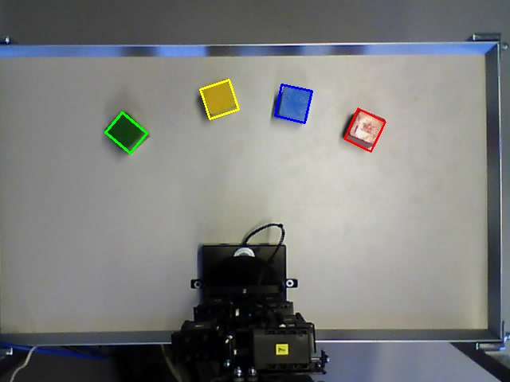

Introduction
========
This repository holds the opencv example which detects rectangles of a certain
area and color. The script is based on various examples found on opencv webpage

Recommended reads

http://docs.opencv.org/

http://docs.opencv.org/doc/tutorials/imgproc/opening_closing_hats/opening_closing_hats.html

http://docs.opencv.org/doc/tutorials/imgproc/table_of_content_imgproc/table_of_content_imgproc.html

Example
========

